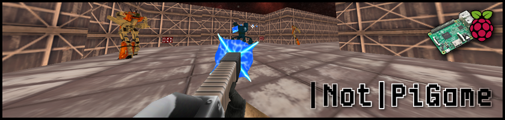

# |Not|PiGame

###### *A project of mine once made for the Raspberry Pi, but now for Windows.*

## **About**

|Not|PiGame was a **Y1 student solo project** and was developed for the **Raspberry Pi 3B**. The project itself was about programming on embedded systems and learning about engine programming. As programming students, we were encouraged to share knowledge with each other and help each other if we got stuck.

|Not|PiGame was more of a tech-demo showing of the C++ custom engine/framework. Which was completely made from scratch. Engine structure, input, asset loading to OpenGL rendering, and making it all work on the Raspberry Pi, was done by me. The project taught me basic engine structure and it improved my C++ skills. Some of the code and decisions made were definitely not the best, but making those mistakes helps develop yourself as a programmer.

This repository contains modified code of the original Raspberry Pi tech-demo so that it would run on Windows Platforms. (Hence the name; *|NOT|*PiGame.) The porting job was to just get it into a functional state, therefore the rendering is slightly glitching.

The tech-demo/game itself was inspired by the old *DOOM* and *Quake* games. The gameplay is fairly minimal, but it is there to mainly showcase the game and the engine working on the Raspberry Pi computer.

## **Licence**

NotPiGame Code: All Rights Reserved / Copyright © 2019 - By TDCRanila

Dependencies: GLFW, GLAD, and GLM below to their respected owners.
Art: All art assets belong to their respected owners. 
